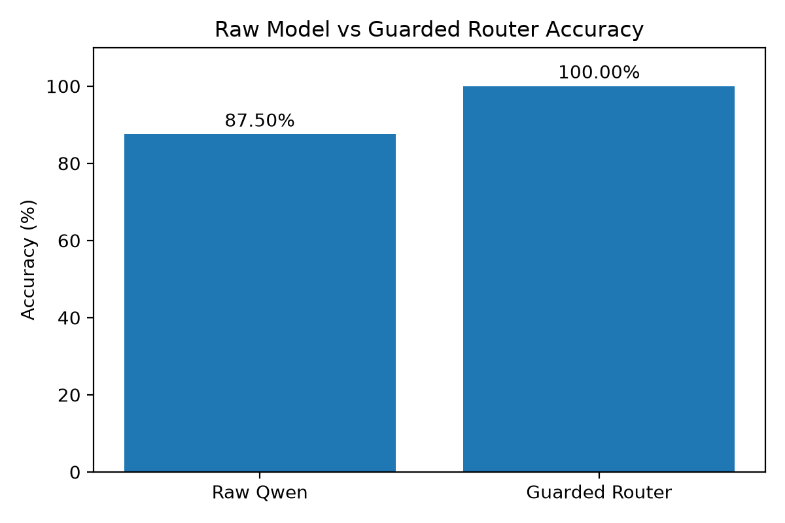
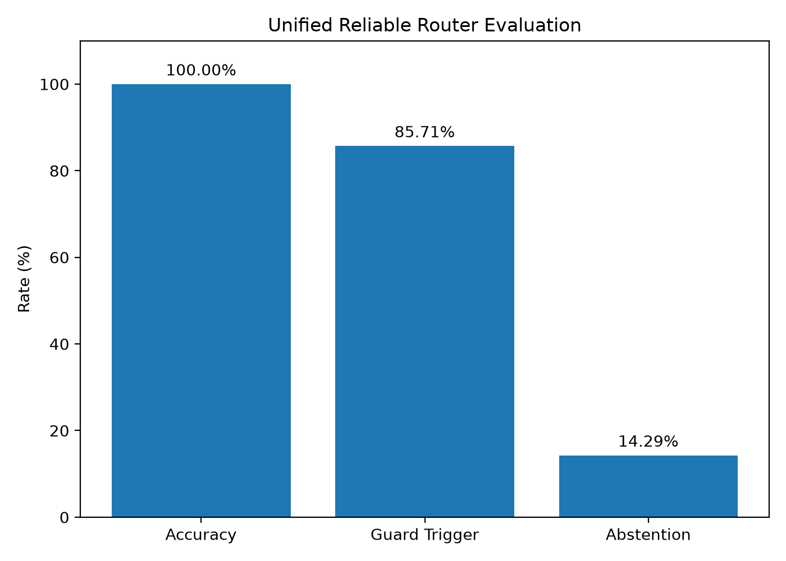
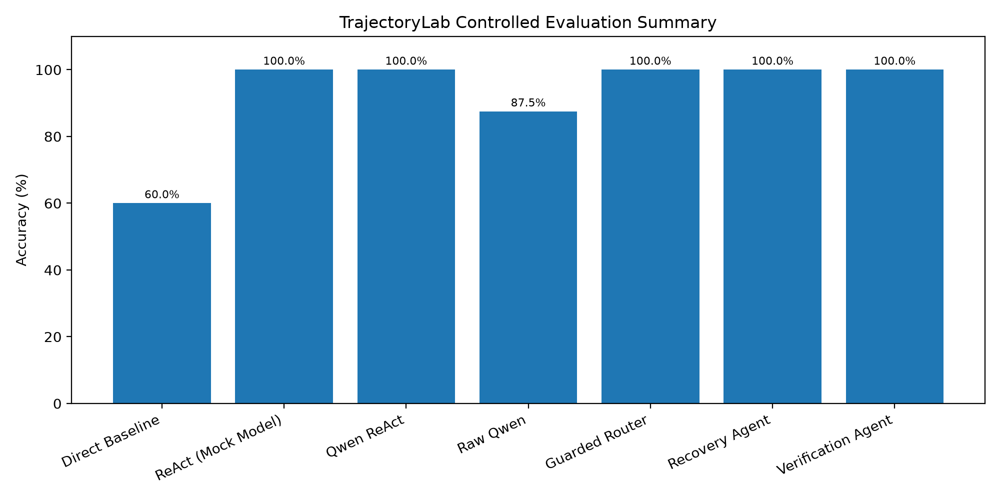

# TrajectoryLab

**ReAct Replication and Reliability Analysis of Tool-Using Language Agents**

TrajectoryLab is a research-oriented implementation exploring how tool-using language agents behave when tool execution is unreliable.

The project begins with the **ReAct** paradigm — interleaving reasoning with actions and observations — and extends the basic agent with reliability mechanisms for:

- deterministic tool routing
- explicit tool-failure recovery
- silent-error verification
- automatic correction
- unsupported-task abstention
- trajectory-level evaluation

The central question is:

> Is producing the correct answer enough, or should a tool-using agent also be evaluated on how reliably it obtained that answer?

TrajectoryLab evaluates both.

---

## Research Foundation

This project is inspired by:

**ReAct: Synergizing Reasoning and Acting in Language Models**  
Shunyu Yao, Jeffrey Zhao, Dian Yu, Nan Du, Izhak Shafran, Karthik Narasimhan, and Yuan Cao.  
ICLR 2023.

ReAct combines reasoning traces with actions so that language models can interact with external environments and tools while solving tasks.

TrajectoryLab reproduces the core interaction pattern:

```text
Thought
  ↓
Action
  ↓
Action Input
  ↓
Observation
  ↓
Thought
  ↓
Final Answer
```

The project then studies what happens when this execution process becomes unreliable.

---

# Motivation

Final-answer accuracy does not necessarily imply reliable agent behavior.

A tool-using model may:

- answer directly instead of calling the required tool
- select the wrong tool
- generate malformed tool calls
- fabricate observations
- fail when a tool becomes unavailable
- trust plausible but incorrect tool outputs
- repeatedly call tools unnecessarily
- route unsupported requests to inappropriate tools

These problems motivated the reliability extensions implemented in TrajectoryLab.

---

# System Architecture

The final architecture combines guarded routing with failure recovery and verification.

```text
                     User Question
                          |
                          v
                  +----------------+
                  | Routing Guard  |
                  +----------------+
                          |
              +-----------+-----------+
              |                       |
              v                       v
         Calculator                 Lookup
              |
              v
       Primary Execution
              |
       +------+------+
       |             |
       v             v
 Explicit Error?   Silent Fault?
       |             |
      Yes           Yes
       |             |
       v             v
   Recovery      Verification
       |             |
       v             v
Fallback Tool     Correction
       |             |
       +------+------+
              |
              v
         Final Answer
              |
              v
       Trajectory Logging
```

For unsupported requests, the router can abstain rather than forcing an unrelated tool call.

---

# Project Structure

```text
trajectory-lab/
│
├── src/
│   ├── agent.py
│   ├── baseline.py
│   ├── environment.py
│   ├── guarded_agent.py
│   ├── guarded_router.py
│   ├── model_interface.py
│   ├── parser.py
│   ├── prompts.py
│   ├── react_recovery_agent.py
│   ├── recovery_agent.py
│   ├── reliability_agent.py
│   ├── reliable_guarded_agent.py
│   ├── reliable_guarded_router.py
│   ├── tools.py
│   └── verification_agent.py
│
├── experiments/
│   ├── baseline evaluation
│   ├── ReAct evaluation
│   ├── recovery experiments
│   ├── verification experiments
│   ├── trajectory analysis
│   ├── real-model evaluation
│   ├── guarded-router evaluation
│   └── unified reliability evaluation
│
├── tests/
│   ├── unit tests
│   └── integration tests
│
├── results/
│   ├── CSV experiment results
│   ├── JSON trajectory traces
│   └── PNG plots
│
├── requirements.txt
├── .gitignore
└── README.md
```

---

# Core ReAct Agent

The base implementation follows a ReAct-style execution loop.

A typical trajectory is:

```text
Question: What is 6 * 7?

Thought: I should calculate this.
Action: calculator
Action Input: 6 * 7

Observation: 42

Thought: I have the result.
Final Answer: 42
```

The implementation separates:

- prompt construction
- model generation
- output parsing
- tool execution
- trajectory recording

The parser recognizes either an agent action or a final answer.

---

# Tools

TrajectoryLab currently contains a calculator and a controlled factual lookup tool.

## Calculator

Arithmetic expressions are evaluated using a restricted Python AST evaluator instead of unrestricted `eval`.

Example:

```text
Input:
(15 + 5) * 3

Output:
60
```

## Lookup

A small local knowledge base supports controlled factual retrieval.

Example queries include:

```text
capital of japan
capital of france
creator of python
```

Example:

```text
Input:
capital of japan

Output:
Tokyo
```

The local knowledge base is intentionally small because the current project focuses on agent execution reliability rather than large-scale retrieval.

---

# Failure Injection

To evaluate reliability behavior, TrajectoryLab deliberately introduces two different failure modes.

## 1. Explicit Tool Failure

An unreliable calculator simulates an unavailable tool.

Example response:

```text
ERROR: calculator temporarily unavailable
```

Because the failure is visible, the agent can detect it and execute a fallback strategy.

---

## 2. Silent Tool Failure

A faulty calculator returns a plausible but incorrect value.

For example:

```text
8 * 8 -> 63
```

This failure is more difficult because the tool does not report an error.

The result therefore requires independent verification.

---

# Recovery Agent

The recovery mechanism handles explicit tool failures.

Example:

```text
Question
   |
   v
Unreliable Calculator
   |
   v
ERROR
   |
   v
Failure Detected
   |
   v
Trusted Calculator
   |
   v
Correct Result
```

For the controlled expression:

```text
(15 + 5) * 3
```

the unreliable calculator produces an explicit failure.

The fallback calculator evaluates the original expression and returns:

```text
60
```

The recovery event is stored in the execution trajectory.

---

# Verification Agent

Explicit failures are relatively easy to detect.

Silent errors are more dangerous because the output may appear valid.

For:

```text
8 * 8
```

the deliberately faulty calculator returns:

```text
63
```

The verification layer independently executes the trusted calculator:

```text
64
```

Because the results disagree, the agent records a correction event and returns the trusted result.

The trajectory becomes:

```text
Guard
  |
  v
Faulty Calculator
  |
  v
63
  |
  v
Verification
  |
  v
Trusted Calculator
  |
  v
64
  |
  v
Correction
  |
  v
64
```

---

# Real Language Model Integration

TrajectoryLab also integrates a real instruction-tuned language model:

```text
Qwen/Qwen2.5-0.5B-Instruct
```

The implementation uses Hugging Face Transformers.

The model interface applies the tokenizer's chat template before generation so that the instruction-tuned model receives prompts in its expected conversational structure.

The experiments were designed to remain CPU-friendly.

---

# Real-Model ReAct Observation

A small seven-task real-model evaluation produced an interesting result:

| Metric | Result |
|---|---:|
| Answer Accuracy | 100.00% |
| Correct Tool Selection Rate | 57.14% |
| Average Steps | 1.57 |
| Average Tool Calls | 0.57 |
| Error Rate | 0.00% |

The important observation is the gap between:

```text
Answer Accuracy = 100%
```

and:

```text
Correct Tool Selection = 57.14%
```

The model could often answer simple questions correctly from its internal knowledge or arithmetic ability while ignoring the intended tool-use policy.

Therefore:

> Correct answers do not necessarily imply correct agent execution.

This became one of the motivations for introducing guarded tool routing.

---

# Guarded Routing

TrajectoryLab introduces a deterministic routing layer for supported tasks.

Arithmetic questions are routed to:

```text
calculator
```

Supported factual questions are routed to:

```text
lookup
```

The purpose of the guard is not to improve the language model's reasoning ability.

Instead, it enforces an execution policy when a deterministic tool is expected to be used.

---

# Raw Model vs Guarded Router

A controlled eight-task evaluation compared raw Qwen responses against guarded routing.

Results:

| Metric | Result |
|---|---:|
| Tasks | 8 |
| Raw Qwen Accuracy | 87.50% |
| Guarded Router Accuracy | 100.00% |
| Guard Trigger Rate | 100.00% |

One constructed arithmetic case exposed the difference.

Question:

```text
What is (15 + 5) * 3?
```

In the controlled run, the raw model returned an incorrect result.

The guarded router instead extracted:

```text
(15 + 5) * 3
```

and required execution through the calculator.

Result:

```text
60
```

The improvement should therefore be interpreted as **tool-policy enforcement**, not as improved language-model reasoning.

---

# Reliable Guarded Agent

Guarded routing was then combined with recovery and verification.

The reliability pipeline became:

```text
Route
  |
  v
Execute Tool
  |
  v
Detect Failure
  |
  +----------------------+
  |                      |
  v                      v
Explicit Failure      Silent Fault
  |                      |
  v                      v
Recovery             Verification
  |                      |
  v                      v
Fallback              Correction
  |                      |
  +----------+-----------+
             |
             v
        Final Answer
```

---

# Reliable Guarded Benchmark

A five-task controlled reliability evaluation included:

- normal arithmetic
- explicit tool failure
- silent tool fault
- unsupported request

Results:

| Metric | Result |
|---|---:|
| Tasks | 5 |
| Accuracy | 100.00% |
| Guard Trigger Rate | 80.00% |
| Recovery Events | 1 |
| Verification Events | 1 |
| Correction Events | 1 |

The unsupported question was intentionally left unrouted.

This is useful because it demonstrates that the guard does not simply trigger for every request.

---

# Unified Reliable Router

The final system combines both calculator and factual routing with the reliability mechanisms.

It supports:

- arithmetic routing
- factual lookup routing
- explicit failure detection
- fallback recovery
- silent-error verification
- correction
- abstention
- trajectory logging

The execution policy can be summarized as:

```text
Route
  ->
Execute
  ->
Detect
  ->
Recover / Verify
  ->
Correct
  ->
Return
  ->
Log
```

---

# Unified Reliable Router Benchmark

The final controlled benchmark contains seven scenarios covering:

- normal arithmetic
- explicit calculator failure
- silent calculator fault
- factual lookup
- unsupported-task abstention

Results:

| Metric | Result |
|---|---:|
| Tasks | 7 |
| Accuracy | 100.00% |
| Guard Trigger Rate | 85.71% |
| Abstention Rate | 14.29% |
| Recovery Events | 1 |
| Verification Events | 1 |
| Correction Events | 1 |
| Average Trajectory Events | 2.29 |

The abstention rate corresponds to the deliberately unsupported task.

Instead of forcing an arbitrary tool call, the router returns no supported route.

---

# Trajectory-Level Evaluation

TrajectoryLab records execution trajectories rather than evaluating only final answers.

A trajectory can contain events such as:

```text
guard
action
recovery
verification
correction
```

For the five-run reliability evaluation:

| Metric | Result |
|---|---:|
| Runs | 5 |
| Average Trajectory Events | 2.40 |
| Guard Events | 5 |
| Tool Actions | 4 |
| Recovery Events | 1 |
| Verification Events | 1 |
| Correction Events | 1 |
| Recovery Rate | 20.00% |
| Verification Rate | 20.00% |
| Correction Rate | 20.00% |

This makes the internal execution behavior observable.

---

# Experimental Summary

The following table summarizes the main controlled experiments.

| Experiment | Accuracy / Metric |
|---|---:|
| Direct Baseline | 60.00% |
| Mock ReAct | 100.00% |
| Qwen ReAct Answer Accuracy | 100.00% |
| Qwen ReAct Tool Selection | 57.14% |
| Raw Qwen Controlled Accuracy | 87.50% |
| Guarded Router | 100.00% |
| Reliable Guarded Benchmark | 100.00% |
| Unified Reliable Router | 100.00% |

**Important:** these results come from different small controlled task sets.

They should not be interpreted as scores from one common benchmark or used as direct model-performance comparisons.

---
## Key Result Visuals

### Raw Qwen vs Guarded Router

The guarded router improves reliability by enforcing deterministic tool use for supported tasks rather than allowing the model to bypass required tools.



### Unified Reliability Evaluation

The unified router combines guarded routing, explicit failure recovery, silent-error verification, correction, and abstention.



### Reliability Mechanism Ablation

The ablation summary compares the major agent variants and reliability mechanisms evaluated in TrajectoryLab.



# Key Finding

The central observation of TrajectoryLab is the distinction between:

```text
Answer Correctness
```

and:

```text
Execution Reliability
```

A language model may produce the correct answer while:

- ignoring the required tool
- selecting the wrong tool
- fabricating intermediate reasoning
- failing to recover from tool errors
- trusting incorrect tool outputs

Therefore, evaluation of tool-using agents should consider both:

```text
What answer did the agent produce?
```

and:

```text
How did the agent obtain that answer?
```

TrajectoryLab explores this second dimension through trajectory logging, tool-policy enforcement, recovery, verification, correction, and abstention.

---

# Testing

The project contains unit and integration tests covering:

- calculator execution
- factual lookup
- tool registry
- parser behavior
- ReAct execution
- recovery behavior
- verification behavior
- silent-error correction
- guarded arithmetic routing
- guarded factual routing
- unsupported-task abstention
- unified reliability behavior

Current status:

```text
32 passed
```

Run the complete test suite with:

```bash
python -m pytest -v
```

---

# Installation

Clone the repository:

```bash
git clone https://github.com/Lavanya-Jothivel/trajectory-lab.git
cd trajectory-lab
```

Create a virtual environment:

```bash
python -m venv .venv
```

Activate it on Windows PowerShell:

```powershell
.venv\Scripts\Activate.ps1
```

Install dependencies:

```bash
pip install -r requirements.txt
```

---

# Running the Experiments

## Real-model agent evaluation

```bash
python -m experiments.real_agent_eval
```

## Tool-selection evaluation

```bash
python -m experiments.tool_selection_eval
```

## Guarded-router benchmark

```bash
python -m experiments.guarded_router_benchmark
```

## Reliable guarded benchmark

```bash
python -m experiments.reliable_guarded_benchmark
```

## Unified reliable-router benchmark

```bash
python -m experiments.unified_router_benchmark
```

## Reliable trajectory metrics

```bash
python -m experiments.reliable_trajectory_metrics
```

## Full test suite

```bash
python -m pytest -v
```

---

# Results

Generated experiment artifacts are stored under:

```text
results/
```

Important outputs include:

```text
results/real_agent_eval.csv
results/real_agent_accuracy.png

results/guarded_benchmark.csv
results/guarded_benchmark.png

results/guarded_router_benchmark.csv
results/guarded_router_benchmark.png

results/reliable_guarded_benchmark.csv
results/reliable_guarded_trajectories.json

results/reliable_trajectory_metrics.csv
results/reliable_trajectory_metrics.png

results/unified_router_benchmark.csv
results/unified_router_benchmark.png

results/final_results_summary.csv
results/final_results_summary.json
```

Additional baseline, recovery, verification, and trajectory experiment outputs are also retained in the `results/` directory.

---

# Limitations

The current project is a controlled research replication and extension rather than a large-scale agent benchmark.

Current limitations include:

- small task sets
- small local factual knowledge base
- rule-based deterministic routing
- synthetic tool failures
- limited number of real-model tasks
- one small instruction-tuned language model
- arithmetic-focused verification
- no external production tool APIs
- no large standardized agent benchmark yet

The reported 100% results therefore validate the implemented mechanisms **within these controlled settings**.

They should not be interpreted as evidence that the system achieves 100% reliability on arbitrary real-world agent tasks.

---

# Future Work

Potential extensions include:

- evaluation on larger tool-use benchmarks
- multiple language-model backends
- larger retrieval systems
- dynamic tool registries
- semantic tool routing
- confidence-aware routing
- stochastic tool failures
- adversarial tool outputs
- multi-step recovery policies
- latency and cost measurements
- trajectory anomaly detection
- automated policy-compliance scoring
- evaluation on real-world agent environments

---

# Reproducibility

The project stores:

- experiment scripts
- unit and integration tests
- CSV result tables
- JSON trajectories
- generated plots
- consolidated result summaries

This allows individual reliability experiments to be rerun and inspected independently.

---

# Reference

Yao, S., Zhao, J., Yu, D., Du, N., Shafran, I., Narasimhan, K., & Cao, Y. (2023).

**ReAct: Synergizing Reasoning and Acting in Language Models.**

International Conference on Learning Representations (ICLR).

Paper: https://arxiv.org/abs/2210.03629

---

# Disclaimer

TrajectoryLab is an educational and research replication project.

The controlled evaluations are designed to study specific tool-use failure modes and reliability mechanisms. Results should be interpreted within the scope of those experiments.